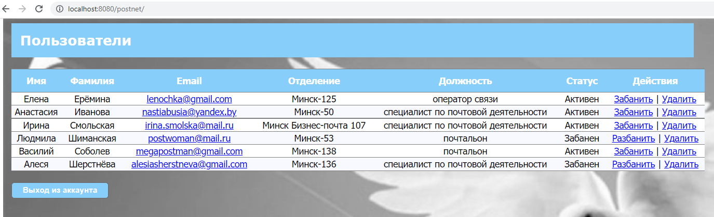

# Выпускной проект "Социальная сеть"
[!IMPORTANT] Получив недавно новые знания и навыки, я поспешила их применить к проекту: переписала 
Hibernate-конфигурацию с XML на аннотации, а также добавила TransactionManagement. В результате "поломались" тесты, 
пока что они не работают. Писать тесты для подобной конфигурации я пока не умею, курс по JUnit-тестированию на Udemy.com 
в планах на ближайшее время.

> [!NOTE]
> Information the user should notice even if skimming.

> [!TIP]
> Optional information to help a user be more successful.

> [!IMPORTANT]
> Essential information required for user success.

> [!CAUTION]
> Negative potential consequences of an action.

> [!WARNING]
> Dangerous certain consequences of an action.

Требования к выпускному проекту для выпускников IT-Academy, претендующих на сертификат, можно увидеть в документах 
"JD2 - дипломный проект.pdf" и "Проект Социальная сеть.pdf"

Социальная сеть "ВОтделении" предназначена для работников отделений связи производства "Минская почта" (специалистов 
по почтовой деятельности, операторов и почтальонов), то есть для всех не руководящих работников минских почт.
Так как времени на написание было мало, фактически получилась соцсеть с функциями "на людей посмотреть 
да себя показать" :-) По возможности, при наличии свободного времени, буду дорабатывать сервис. В планах добавление 
мессенджера и форума для общения.

Реализованные фичи:
<ul>
    <li>Незарегистрированный пользователь:
        <ul>
            <li>Зарегистрироваться в социальной сети</li>
            <li>Создать публичный и приватный профиль</li>
            <li>Видеть публичную информацию зарегистрированных пользователей</li>
            <li>Искать публичную информацию зарегистрированных пользователей</li>
        </ul>
    </li>
    <li>Зарегистрированный пользователь:
        <ul>
            <li>Видеть публичную и приватную информацию зарегистрированных пользователей</li>
            <li>Искать публичную и приватную информацию зарегистрированных пользователей</li>
            <li>Редактировать публичный и приватный профиль</li>
        </ul>
    </li>
    <li>Администратор:
        <ul>
            <li>Видеть публичную и приватную информацию пользователей</li>
            <li>Искать публичную и приватную информацию пользователей</li>
            <li>Активировать и деактивировать учётные записи пользователей</li>
            <li>Удалять учётные записи пользователей</li>
        </ul>
    </li>
</ul>

Приложение устанавливается на Tomcat-9, разворачивается в контекстном пути http://localhost:8080/postnet

Использованные технологии: Java 11 SE, Maven, Tomcat, Liquibase, Hibernate, JDBC, Spring Core, Spring MVC, 
Spring Security, MySQL, Lombok, немного HTML, CSS и JS.

